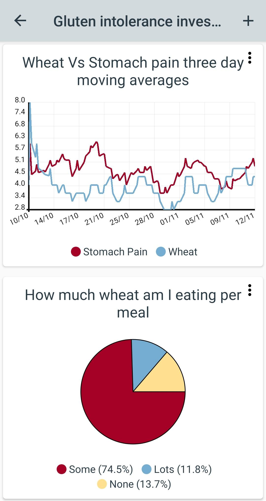
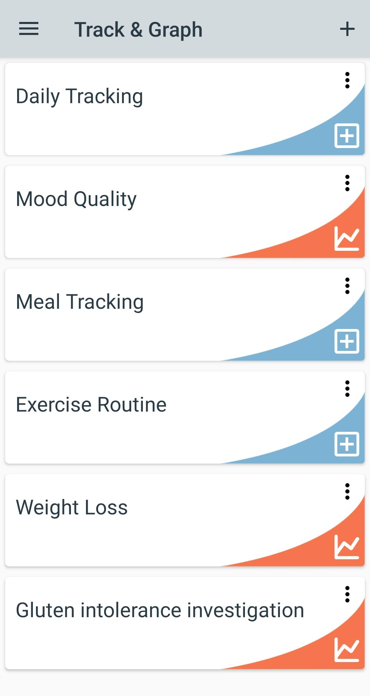
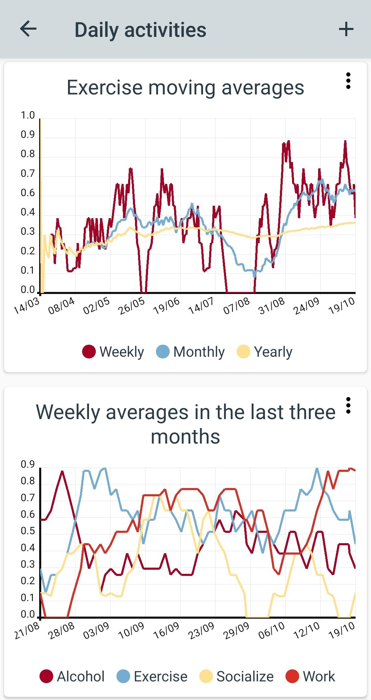

# Track & Graph
<!-- ALL-CONTRIBUTORS-BADGE:START - Do not remove or modify this section -->

<!-- ALL-CONTRIBUTORS-BADGE:END -->
An android app for tracking personal data and creating custom graphs

	<a href='https://play.google.com/store/apps/details?id=com.samco.trackandgraph'>
		
	<a href='https://f-droid.org/packages/com.samco.trackandgraph/'>
		

# Screenshots

	
	
	
	
	
	
	

# Privacy Policy
This app does not record any of your personal information, anything you track or anything you do in the app. Nothing is recorded or stored anywhere online by this app or any third party library used by this app. You can however easily backup your data at any time to your own device or cloud storage service from within the app.

# Contributing
Contributers are welcome. Please raise an issue through GitHub for bug fix or feature requests or email help.trackandgraph@gmail.com if you wish to create a pull request. 

# License
    Copyright (C) 2019-2020 SamAmco <samuel.amco@gmail.com>
    
    Track & Graph is free software: you can redistribute it and/or modify
    it under the terms of the GNU General Public License as published by the
    Free Software Foundation, either version 3 of the License, or (at your
    option) any later version.
    
    Track & Graph is distributed in the hope that it will be useful, but
    WITHOUT ANY WARRANTY; without even the implied warranty of MERCHANTABILITY
    or FITNESS FOR A PARTICULAR PURPOSE. See the GNU General Public License for
    more details.
    
    You should have received a copy of the GNU General Public License along
    with this program. If not, see <http://www.gnu.org/licenses/>.

## Contributors ✨

Thanks goes to these wonderful people ([emoji key](https://allcontributors.org/docs/en/emoji-key)):

<!-- ALL-CONTRIBUTORS-LIST:START - Do not remove or modify this section -->
<!-- prettier-ignore-start -->
<!-- markdownlint-disable -->
<table>
  <tr>
    <td align="center"><a href="https://github.com/pizzapim"> <b>pizzapim</b></a> <a href="https://github.com/SamAmco/track-and-graph/commits?author=pizzapim" title="Code">💻</a></td>
    <td align="center"><a href="https://github.com/Poussinou"> <b>Poussinou</b></a> <a href="https://github.com/SamAmco/track-and-graph/commits?author=Poussinou" title="Documentation">📖</a></td>
    <td align="center"><a href="https://github.com/xerus2000"> <b>Janek</b></a> <a href="#ideas-xerus2000" title="Ideas, Planning, & Feedback">🤔</a> <a href="https://github.com/SamAmco/track-and-graph/issues?q=author%3Axerus2000" title="Bug reports">🐛</a></td>
    <td align="center"><a href="https://android.izzysoft.de/"> <b>Izzy</b></a> <a href="#infra-IzzySoft" title="Infrastructure (Hosting, Build-Tools, etc)">🚇</a></td>
  </tr>
</table>

<!-- markdownlint-enable -->
<!-- prettier-ignore-end -->
<!-- ALL-CONTRIBUTORS-LIST:END -->

This project follows the [all-contributors](https://github.com/all-contributors/all-contributors) specification. Contributions of any kind welcome!
