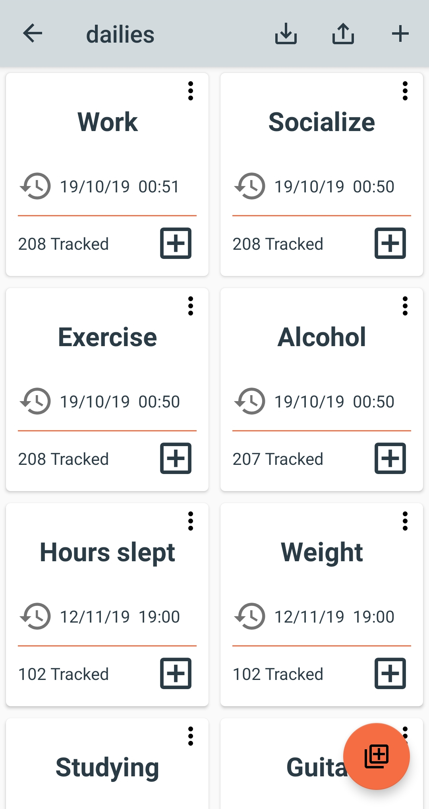
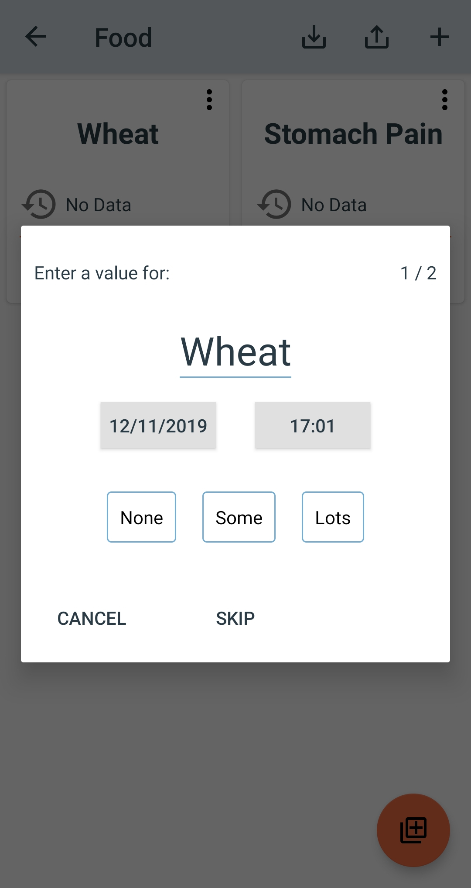
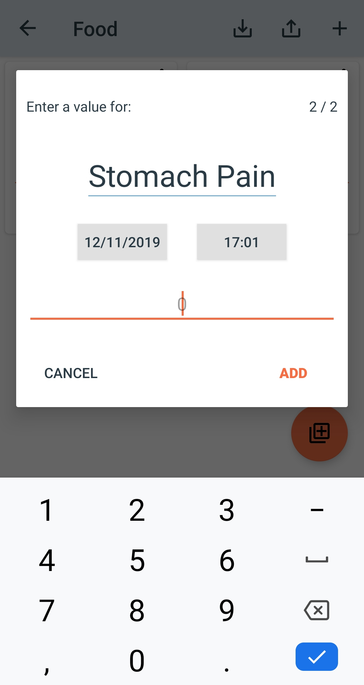
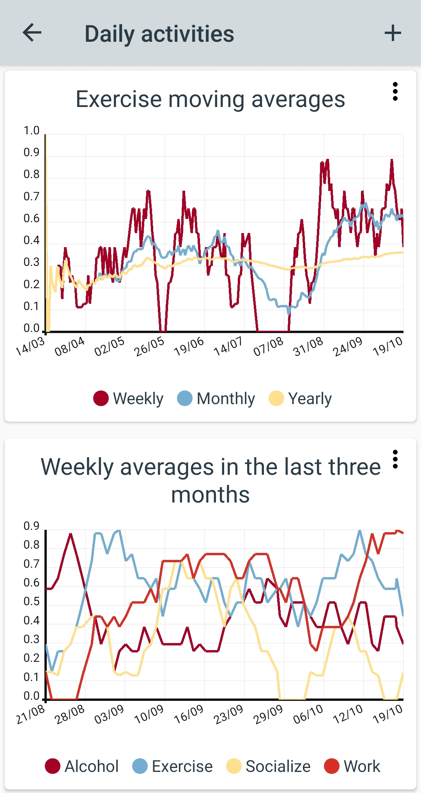
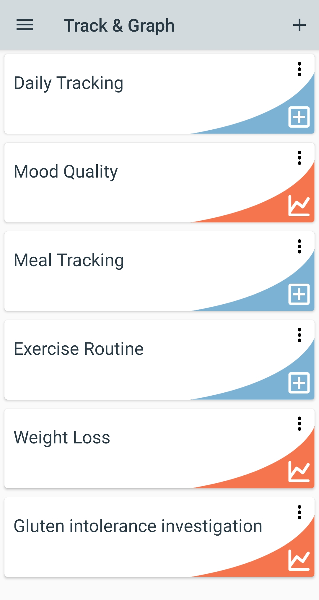

# Track & Graph
An android app for tracking personal data and creating custom graphs

	

# Screenshots

	
	
	
	
	
	

# Privacy Policy
This app does not record any of your personal information, anything you track or anything you do in the app. Nothing is recorded or stored anywhere online by this app or any third party library used by this app. You can however easily backup your data at any time to your own device or cloud storage service from within the app.

# Contributing
Contributers are welcome. Please raise an issue through GitHub for bug fix or feature requests or email help.trackandgraph@gmail.com if you wish to create a pull request. 

# License
    Copyright 2019 SamAmco

    Licensed under the Apache License, Version 2.0 (the "License");
    you may not use this file except in compliance with the License.
    You may obtain a copy of the License at

       http://www.apache.org/licenses/LICENSE-2.0

    Unless required by applicable law or agreed to in writing, software
    distributed under the License is distributed on an "AS IS" BASIS,
    WITHOUT WARRANTIES OR CONDITIONS OF ANY KIND, either express or implied.
    See the License for the specific language governing permissions and
    limitations under the License.
