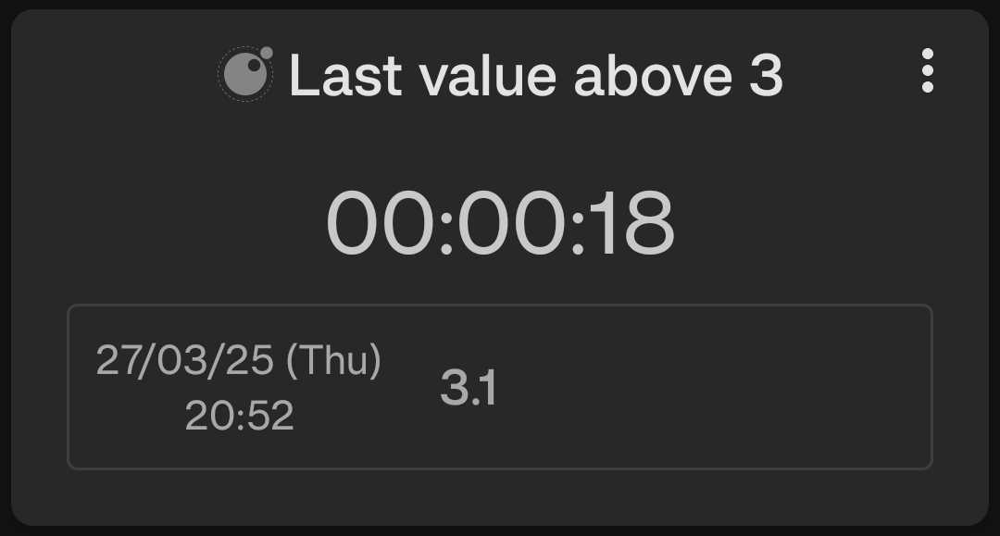

# Last Value Above Threshold

This script returns the last datapoint with a value above a given threshold. It can accept multiple data sources.

<div style="text-align: center;">
    
</div>

## Configuration

This script accepts the following configuration parameters:

```lua
-- The threshold above which the last value is returned
local threshold = 0
```

[Install via deeplink](trackandgraph://lua_inject_url?url=https://www.github.com/SamAmco/track-and-graph/tree/master/lua/community/datapoint/last-value-above-threshold/script.lua)

[Read the full script](./script.lua)

Author: [SamAmco](https://github.com/SamAmco)
