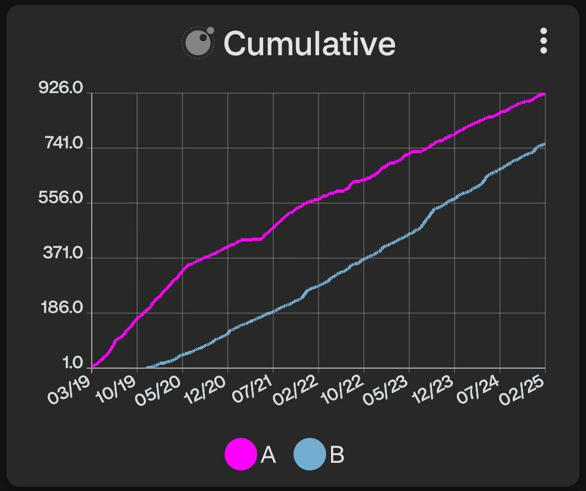

# Cumulative Line Graph Script

This script generates a cumulative line graph for each of the provided data sources.

<div style="text-align: center;">
    
</div>

## Configuration

This script accepts the following configuration parameters:

```lua
local core = require("tng.core")
local graph = require("tng.graph")
-- Optional period of data to be displayed e.g. core.PERIOD.WEEK to only show 1 week of data
local period = nil
-- Optional integer value used with period e.g. 5
local period_multiplier = 8
-- If from_now is false the end of the graph will be the last datapoint, otherwise it's the current date/time
local from_now = false
-- Optional colors list, e.g. {"#FF00FF", "#0000FF", core.COLOR.BLUE_SKY}
local line_colors = nil
-- Optional point style e.g. graph.LINE_POINT_STYLE.CIRCLE
local line_point_style = nil
-- Optional string labels for the lines in the legend, e.g. ["My data 1", "My data 2"]
local line_labels = nil
-- Optional integer value used to average data points over a certain duration e.g. core.DURATION.DAY * 30 for a 30 day moving average
local averaging_duration = nil
-- Optional totalling period used to calculate 'plot totals' e.g. core.PERIOD.WEEK
local totalling_period = nil
-- Optional totalling period multiplier used to calculate 'plot totals' e.g. 2
local totalling_period_multiplier = nil
-- Optional if the y axis represents time
local duration_based_range = false
-- Optional bounds for the y axis e.g. { min = 0, max = 100 }
local range_bounds = nil
```

[Install via deeplink](trackandgraph://lua_inject_url?url=https://raw.githubusercontent.com/SamAmco/track-and-graph/refs/heads/master/docs/docs/lua/community/line-graphs/cumulative/script.lua)

[Read the full script](./script.lua)

Author: [SamAmco](https://github.com/SamAmco)
