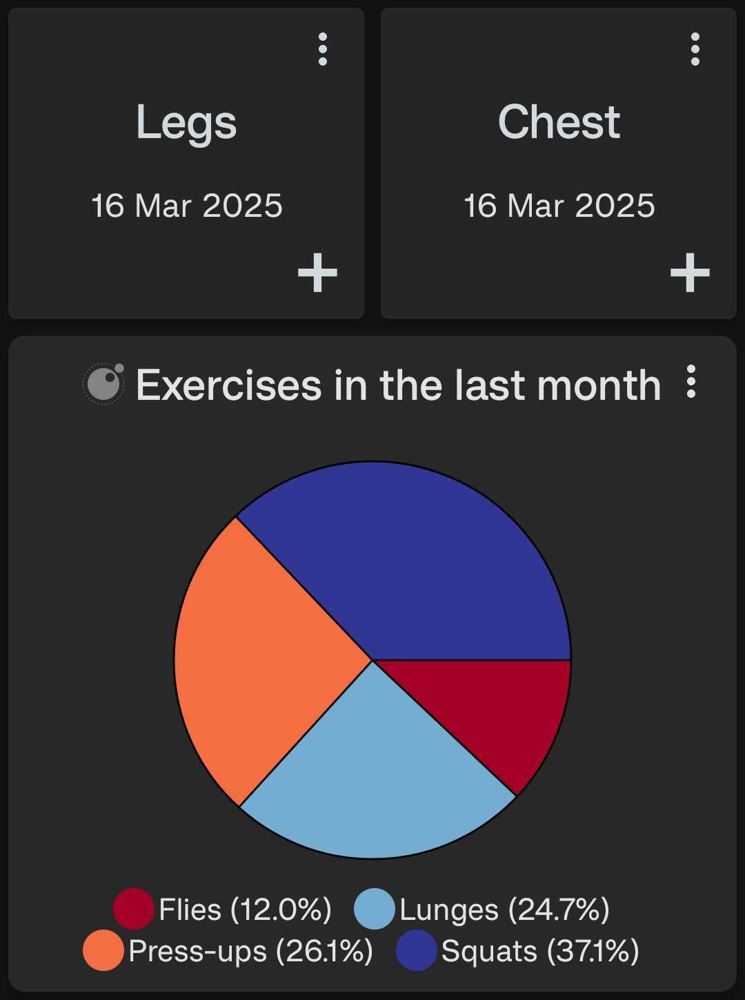

# Merged Pie Chart

A pie chart that merges all given data sources into one pie chart including all data, or all data in the given period prior to now.

<div style="text-align: center;">
    
</div>

## Configuration

This script accepts the following configuration parameters:

```lua
local period = nil
-- Optional integer value used with period e.g. 5
local period_multiplier = nil
-- Optional colors list, e.g. { label: "#FF00FF", label2: "#0000FF", label3: core.COLOR.BLUE_SKY }
local label_colors = nil
-- Boolean to count by label. If true, each datapoint counts as 1, and the value is ignored
local count_by_label = false
```

[Install via deeplink](trackandgraph://lua_inject_url?url=https://raw.githubusercontent.com/SamAmco/track-and-graph/refs/heads/master/docs/docs/lua/community/pie-charts/merged-pie-chart/script.lua)

[Read the full script](./script.lua)

Author: [SamAmco](https://github.com/SamAmco)
