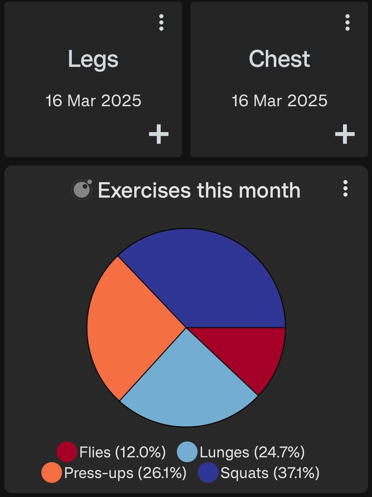

# Periodic Pie Chart

A pie chart that displays data for a specific time period such as the current day, week, month, etc. The pie chart resets at the beginning of each new period and accumulates data throughout that period. This script can accept multiple data sources and merges them all into one pie chart.

<div style="text-align: center;">
    
</div>

## Configuration

This script accepts the following configuration parameters:

```lua
-- Period of data to be displayed e.g. core.PERIOD.WEEK to show data for this week
local period = core.PERIOD.WEEK
-- Optional colors list, e.g. { label="#FF00FF", label2="#0000FF", label3=core.COLOR.BLUE_SKY }
local label_colors = nil
-- Boolean to count by label. If true, each datapoint counts as 1, and the value is ignored
local count_by_label = false
```

[Install via deeplink](trackandgraph://lua_inject_url?url=https://www.github.com/SamAmco/track-and-graph/tree/master/lua/community/pie-charts/periodic-pie-chart/script.lua)

[Read the full script](./script.lua)

Author: [SamAmco](https://github.com/SamAmco)
