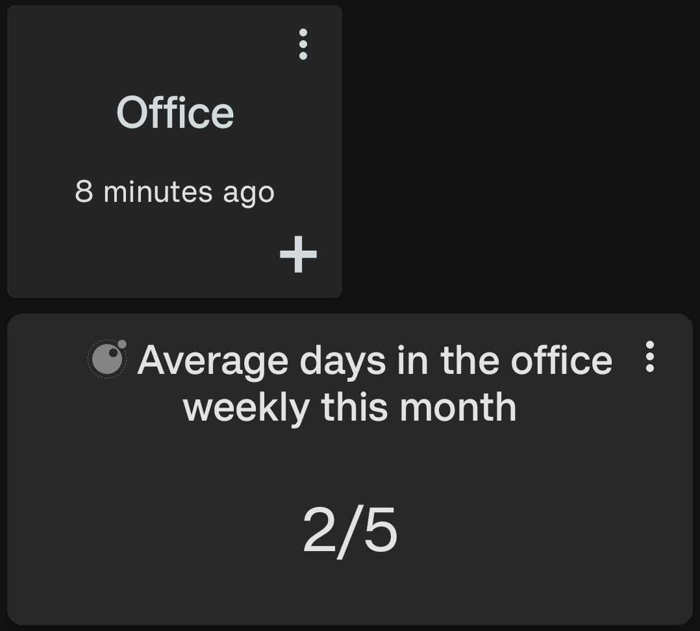

# Fraction Text Display

This script displays a fraction representing the ratio of values with specified labels to total values. 

<div style="text-align: center;">
    
</div>

## Configuration

This script accepts the following configuration parameters:

```lua
-- Optional period of data to be displayed e.g. core.PERIOD.WEEK to show data for this week
local period = nil
-- Optional integer value used with period e.g. 5
local period_multiplier = nil
-- Optional boolean to count by label. If true, each datapoint counts as 1, and the value is ignored
local count_by_label = false
-- Optional fixed denominator value e.g. 100
local fixed_denominator = nil
-- The list of labels to be counted as part of the numerator
local numerator_labels = {}
-- A list of labels to be ignored i.e. not counted as part of the numerator or denominator
local ignored_labels = nil
```

[Install via deeplink](trackandgraph://lua_inject_url?url=https://www.github.com/SamAmco/track-and-graph/tree/master/lua/community/text/fraction/script.lua)

[Read the full script](./script.lua)

Author: [SamAmco](https://github.com/SamAmco)
