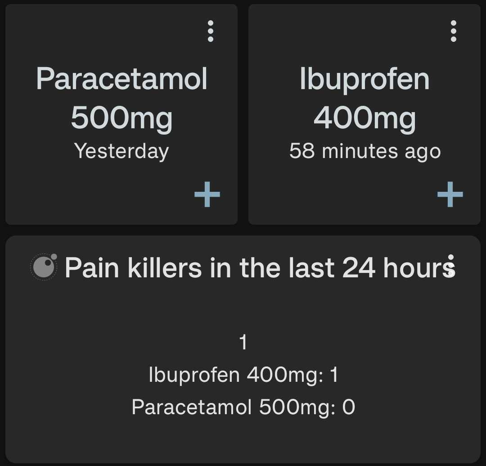

# Total in Last Duration

Shows the total of a given input over a **rolling time window** extending backwards from the current moment. For example:
- "Total in last 24 hours" shows data from exactly 24 hours ago until now
- "Total in last 7 days" shows data from exactly 7 days ago until now  
- "Total in last 30 days" shows data from exactly 30 days ago until now

This uses a **rolling window approach** that moves continuously with time, unlike fixed period boundaries. The window always extends backwards from the current moment by the specified duration.

If multiple data sources are given then the total of each data source is shown separately, as well as the overall total.

<div style="text-align: center;">
    
</div>

## Configuration

This script accepts the following configuration parameters:

```lua
-- Duration of data to total over prior to now (rolling window)
-- e.g. core.DURATION.DAY for total in last 24 hours
local duration = core.DURATION.DAY

-- Multiplier for the duration (e.g. 7 for last 7 days when duration is DAY)
local multiplier = 7
```

[Install via deeplink](trackandgraph://lua_inject_url?url=https://raw.githubusercontent.com/SamAmco/track-and-graph/refs/heads/master/docs/docs/lua/community/text/total-in-last-duration/script.lua)

[Read the full script](./script.lua)

Author: [SamAmco](https://github.com/SamAmco)
