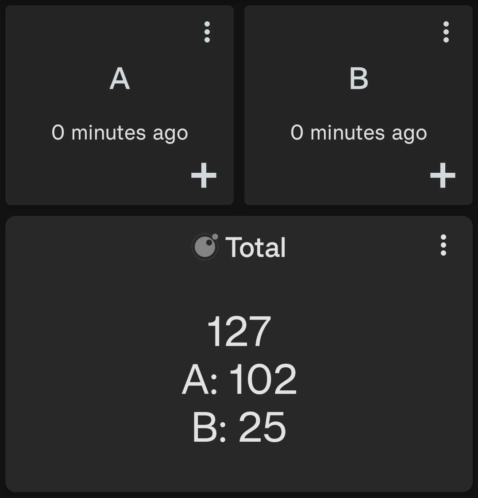

# Total this period

Shows the total of a given input over a specified period of time. For example, the total this week (Monday to Sunday) or the total this month. If multiple data sources are given then the total of each data source is shown separately, as well as the overall total.

<div style="text-align: center;">
    
</div>

## Configuration

This script accepts the following configuration parameters:

```lua
-- Period of data to be displayed e.g. core.PERIOD.WEEK to show data for this week
local period = core.PERIOD.WEEK
```

[Install via deeplink](trackandgraph://lua_inject_url?url=https://www.github.com/SamAmco/track-and-graph/tree/master/lua/community/text/total-this-period/script.lua)

[Read the full script](./script.lua)

Author: [SamAmco](https://github.com/SamAmco)
