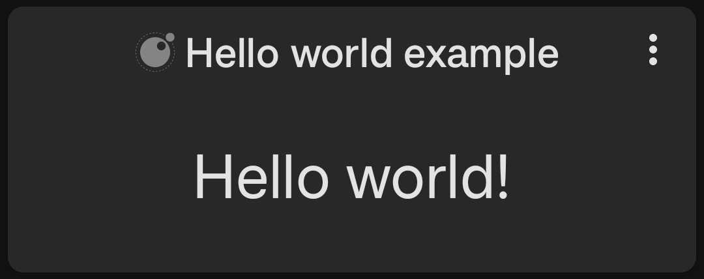
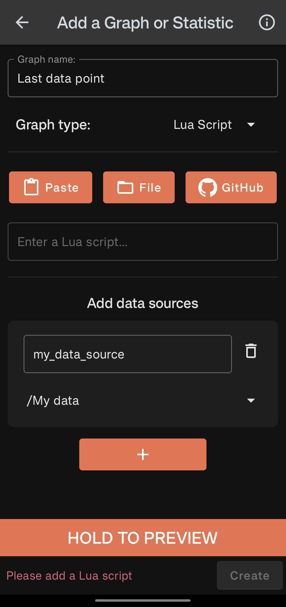

# Writing Graph Scripts

This guide covers writing Lua graph scripts for custom visualizations. If you just want a reference for how to use the Lua graph feature in the app, check out [the tutorial here](../../tutorial/graphs/lua-graphs/lua-graphs.md).

## Writing Your First Script

To get started let's write and save a super simple script: 

```lua
return require("tng.graph").text("Hello world!")
```

Now is a good time to figure out your development flow for testing the script on your device. If you have an easy way to copy and paste text between devices you can use the paste button in the Lua graph configuration. You can also save your workspace to a shared cloud directory or send the file to your device some other way and access it using the file button.

If you load that script into the Lua graph configuration you should see a simple text graph with the words "Hello world!" in it like this: 

{ width="400" }

### Understanding the script
Let's break down what is going on here. First we are using the `require` function to load the `tng.graph` module. This module contains all of the functions that you can use to create graphs. The `text` function creates a simple text graph. Let's take a look at the definition of that function:

```lua
--- Creates a text graph.
--- @since v5.1.0
--- @param params (string|number|TextGraphParams): Either the text to display or the parameters for the text graph.
--- @return table: A table representing the text graph.
M.text = function(params)
	if type(params) ~= "table" then
		return {
			type = M.GRAPH_TYPE.TEXT,
			text = params,
		}
	end
	return {
		type = M.GRAPH_TYPE.TEXT,
		text = params.text,
		size = params.size,
		align = params.align,
	}
end
```

Essentially this function takes a string, number, or a table of parameters and returns a table that represents the graph. The table contains a `type` field that tells the app what type of graph it is, and then any other parameters that are needed to create the graph. In this case we are just passing in a string, so the function creates a table with the `type` field set to `GRAPH_TYPE.TEXT` and the `text` field set to the string we passed in.

So our script ultimately returned a table that looks like this:

```lua
{
  type = "TEXT",
  text = "Hello world!",
}
```

Notice you could get the same result by writing your script like this:

```lua
local graph = require("tng.graph")

return {
  type = graph.GRAPH_TYPE.TEXT,
  text = "Hello world!",
}
```

Whenever Track & Graph needs to generate the view data for your Lua graph it will call the script and use the returned table to create the graph. For example your script is run to generate the preview in the Lua graph configuration screen, and whenever you open the group that contains your Lua graph.

## What graphs can I create?

Returning to the tng/graph.lua file notice the params object references the class name TextGraphParams. If you look further up the file you will find the definition of that class:

```lua
--- @since v5.1.0
--- @class TextGraphParams
--- @field text (string|number): The text to display.
--- @field size? integer: 1-3 The size of the text small, medium or large. Defaults to large.
--- @field align? string: start, centre, or end The alignment of the text. Defaults to centre.
```

Note that a parameter with a `?` after it means that it is optional. If you don't provide a value for that parameter, the function will use a default value. 

You can also see the other types of graphs you can return and the parameters they expect in this file, they are: 

- Text
- Data Point
- Time Bar charts (but not Histograms currently)
- Line Graphs
- Pie Charts

For further inspiration I recommend checking out the [community scripts](../community/index.md).

## Using data sources

A Lua graph script can actually return one of two things. It can return a table with the data in it as we've seen above, or it can return a function which accepts a table of named data sources. Track & Graph will then:

1. Execute the script to get it's return value (in this case a function).
2. Realise that the return value is a function and call it, passing in the data sources configured in the app.
3. Use the return value of that function to create the graph.

For example if you were to configure your Lua graph with a data source that contains at least one data point like this:

{ width="300" }

Then you could use the following script to return the most recent data point from that data source:

```lua
return function(sources)
  return {
    type = require("tng.graph").GRAPH_TYPE.DATA_POINT,
    datapoint = sources["my_data_source"].dp(),
  }
end
```

Here `sources["my_data_source"]` is actually returning a `DataSource` object. Take a look at the `tng/core.lua` file to see the definition of this class and what other functions are available on it. Notice the definition of this function is empty:

```lua
--- Fetches the next data point from the data source.
--- Data points are iterated in reverse chronological order.
--- @since v5.1.0
--- @return DataPoint
function DataSource.dp() end
```

That's because the implementation of this data source is actually written in the kotlin code of the android app. [ You can see that here ](https://github.com/SamAmco/track-and-graph/blob/master/app/src/main/java/com/samco/trackandgraph/lua/apiimpl/LuaDataSourceProviderImpl.kt) if you are interested but it is not necessary to read the kotlin code.

## Script Previews

If you have downloaded any of the community scripts you may have noticed that only the configuration parameters of the script are immediately visible. This is because the script preview will only show the code between the comments:

```lua
--- PREVIEW_START
```

and 

```lua
--- PREVIEW_END
```

You can use this to make the most important information about your script immediately visible like the name of the script and any configuration parameters e.g.

```lua
--- PREVIEW_START
-- Script: Text - Total This Period
-- Period of data to be displayed e.g. core.PERIOD.WEEK to show data for this week
local period = core.PERIOD.WEEK
--- PREVIEW_END
```

## Contributing to the community scripts

You already have all the tools you need to write and run your own scripts. If you create something you think is very useful and you want to share it with the community, you can create a PR into the Track & Graph repository. However community scripts will require a few more things before they can be committed to the repository. In general you will need 4 things:

1. A README.md file that describes the script and how to use it
2. A screenshot of the graph that the script generates
3. A test file, or multiple test files, that contain the test cases for the script
4. The script file that contains the code

### File Structure

Community scripts are organized in two separate locations:

**Lua scripts and tests** go in `lua/src/community/graphs/`:
```
lua/src/community/graphs/<category>/<script-name>/
  ├── <script-name>.lua          # Main script file
  └── test_<script-name>.lua     # Test file(s) (prefix with test_)
```

**Documentation and images** go in `docs/docs/lua/community/`:
```
docs/docs/lua/community/<category>/<script-name>/
  ├── script.lua                 # Generated from lua/src via make sync-lua-to-docs
  ├── README.md                  # Documentation
  └── image.png                  # Screenshot
```

For example, the fraction script has:
- Code: `lua/src/community/graphs/text/fraction/fraction.lua` and `test_fraction.lua`
- Docs: `docs/docs/lua/community/text/fraction/script.lua`, `README.md`, and `image.png`

You can see examples of [scripts here](https://github.com/SamAmco/track-and-graph/tree/master/lua/src/community/graphs) and [docs here](https://github.com/SamAmco/track-and-graph/tree/master/docs/docs/lua/community).

**Important:** The `script.lua` file in the docs directory is automatically generated. After making changes to your script in `lua/src/community/graphs/`, run `make sync-lua-to-docs` to copy it to the docs location. You only need to manually create the `README.md` and image files in the docs directory.


## Writing Tests

Writing tests is important not only to ensure your code works as expected (particularly around edge cases) but also to make sure that your script continues to work as the Track & Graph API evolves. If your script relies on some implementation detail or method call in the Track & Graph Lua API, and that function changes in a future version, then your script may be left broken without anyone noticing except disgruntled users.

### The Testing Framework

Track & Graph provides a testing framework for Lua scripts that runs your tests in the same Lua environment that's used in the production app. This gives greater assurances that if your tests pass, your script will work correctly in the actual app.

You can create as many test files as you like for your script as long as each one starts with the word `test_` and ends with `.lua`. For example, if your script is called `my_script.lua`, you could create a test file called `test_my_script.lua`. The test files should be placed in the same directory as your script.

### The Testing Approach

Graph scripts use **text-based config overrides**. Your script defines local variables for configuration (like `local period = nil`), and the test harness uses regex to replace these declarations with test values. This is why config values in tests are strings containing Lua code.

### Test File Structure

A test file is a Lua module that returns a table of test cases. Each test case specifies:

1. Configuration overrides (as strings of Lua code)
2. A set of named mock data sources
3. Assertions to validate the script's output

Here's an example test file:

```lua
local M = {}

local core = require("tng.core")
local graph = require("tng.graph")
local test = require("test.core")

local DDAY = core.DURATION.DAY

M.test_basic_case = {
    config = {
        -- Config values are strings of Lua code that replace local variable declarations
        numerator_labels = "{'A', 'B'}",
        period = "core.PERIOD.WEEK",
        count_by_label = "true",
    },
    sources = function()
        local now = core.time().timestamp
        return {
            source1 = {  -- Named data source matching your script
                {
                    timestamp = now - (DDAY * 1),
                    value = 10.0,
                    label = "A",
                },
                {
                    timestamp = now - (DDAY * 2),
                    value = 5.0,
                    label = "B",
                },
            },
        }
    end,
    assertions = function(result)
        test.assert("result was nil", result)
        test.assertEquals(graph.GRAPH_TYPE.TEXT, result.type)
        test.assertEquals("15/30", result.text)
    end,
}

return M
```

### Creating Test Cases

Each test should be defined as a field in your module's table. The value should be a table with the following fields:

#### 1. `config` (table)

The `config` table contains values that will override variables in your script. For example, if your script defines `local period = core.PERIOD.MONTH`, your test can override it with `config = { period = "core.PERIOD.WEEK" }`.

**Important**: Configuration overrides are always strings, not references to the values themselves. Use `"core.PERIOD.WEEK"` rather than `core.PERIOD.WEEK`. That's because the testing framework uses a regex to overwrite the first declaration matching the config name in your script before executing it.

#### 2. `sources` (function)

The `sources` function should return a table of named mock data sources that will be passed to your script. Each source is a table of data points:

```lua
sources = function()
  local core = require("tng.core")
  local now = core.time().timestamp

  return {
    -- First data source named "steps"
    steps = {
      { timestamp = now - 86400, value = 5000, label = "walking" },
      { timestamp = now - 172800, value = 7500, label = "running" },
    },
    -- Second data source named "calories"
    calories = {
      { timestamp = now - 86400, value = 300 },
      { timestamp = now - 172800, value = 450 },
    }
  }
end
```

#### 3. `assertions` (function)

The `assertions` function receives the result of your script and should validate that it's correct:

```lua
assertions = function(result)
  local test = require("test.core")
  local graph = require("tng.graph")
  test.assert("result was nil", result)
  test.assertEquals(graph.GRAPH_TYPE.TEXT, result.type)
  test.assertEquals("12500", result.text)
end
```

### Test Assertions

The `test.core` module provides:

- `test.assert(message, condition)` - Assert condition is truthy
- `test.assertEquals(expected, actual)` - Assert values are equal (converts to strings for comparison)
- `test.assertClose(expected, actual, tolerance)` - Assert numbers are close (default tolerance: 0.01)

You can also use the `error` function directly:

```lua
assertions = function(result)
  if result.text ~= "Hello world!" then
    error("Expected 'Hello world!', got '" .. result.text .. "'")
  end
end
```

For more comprehensive testing examples, see the [community script test files](https://github.com/SamAmco/track-and-graph/tree/master/lua/src/community/graphs) which demonstrate common patterns for time-based scenarios, multi-source testing, and edge cases.

### Running Tests

From the repository root:

```bash
make run-community-graph-tests
```

### Debugging Tests

Debugging scripts and tests can be a bit tricky since you will generally have to work without a breakpoint debugger in your Lua code.

You can use the `error` and `print` functions to help narrow down issues. The `print` function takes any set of arguments and tries to convert them to strings before printing them to the test output:

```lua
print("Hello world!") -- prints "Hello world!"
print(123) -- prints "123"
print({ key = "value" }) -- prints e.g. "table: 1ddd3478"
print("Hello ", "world!") -- prints "Hello world!"
```

Notice that only primitives like strings and numbers will print readably. Tables will not print their contents but instead their memory address, so you need to access their fields to print them effectively.

**Tips for debugging:**

1. Check that config keys match your script's local variable names exactly
2. Verify the config values are valid Lua code (strings, not actual Lua types)
3. Ensure source names match how your script accesses them
4. Add `print()` statements to your script to debug data flow (visible in test output)

Please make sure to remove any `print` statements before you submit your PR.
