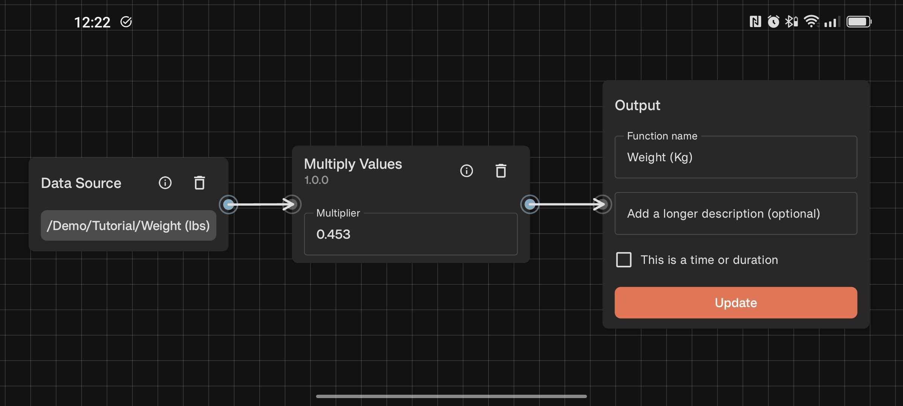
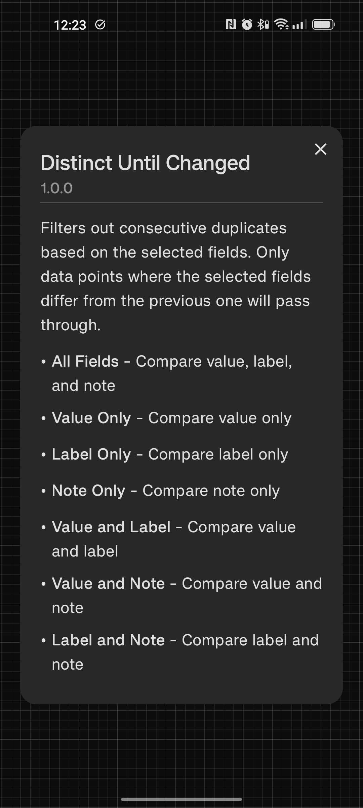

# Functions

Functions allow you to create custom data sources by transforming and combining existing trackers. Using a visual node editor, you can build graphs that process your data in powerful ways.

## What are Functions?

A Function is a new data source that derives its data from one or more trackers or functions. Once created, you can use a Function just like a tracker - add it to graphs, view the history as a list, or use it in other Functions.

Think of Functions as pipelines: data flows from your trackers (inputs) through processing steps (function nodes) to produce a new data source (output).

## Creating Your First Function

To create a Function, tap the + icon in a group and select "Function" from the menu.

### The Output Node

When you open the Function editor, you'll see an **Output Node** card. This represents the data source you're creating:

- **Name**: Give your Function a name (required)
- **Description**: Add an optional description to explain what this Function does in more detail
- **Duration checkbox**: Check this if the output values should be interpreted as durations (in seconds). You may want to check this box if your input data sources are timer/duration trackers for example.

The Output Node has an **input connector** on the side. This is where you'll connect the data you want to output.

### Adding Function Nodes

To add nodes to your Function, **long press anywhere in the empty space**. This opens the **Function Catalog**, which shows all available function nodes organized by category.

Each function node typically has:

- **Input connectors**: Where data flows in
- **Output connector**: Where processed data flows out

### Connecting Nodes

To connect nodes, **drag from an output connector to an input connector**. You can connect multiple output connectors to the same input connector - their data will be merged in reverse chronological order.

**Note:** You cannot create connections that would form a cycle in the graph, and you must always start from an output and drag to an input.

## Example 1: Merging Multiple Trackers

The simplest use of Functions is combining data from multiple trackers into a single data source.

Let's say you track exercise in two separate trackers - one for running and one for cycling. You can merge them into a single "Exercise" data source:

Now your "Exercise" Function contains all data points from both trackers, merged in reverse chronological order. You can use this in graphs or statistics to see your total exercise activity.

Taking this a step further you could create a Function that only outputs the exercise that you've done this week by adding a **Filter After Last** node connected to a **Periodic Data Points** generator set to weekly intervals:

## Example 2: Converting Units with Transformations

Functions can transform your data using simple operations. Let's say you track your weight in pounds, but want to see it in kilograms for a specific graph.

You can create a "Weight (Kg)" Function by connecting your "Weight" tracker to a **Multiply Values** node (set to 0.453592), then connecting that to the Output Node.

Now you have a data source showing your weight in kilograms without changing your original tracker. 

Furthermore if you track your weight sometimes in kilograms and sometimes in pounds (using labels), you can create a more complex Function that only converts values with the label "lbs":

## Exploring Further

For a deeper understanding of what's possible with Functions, I recommend exploring the Function Catalog and experimenting with different nodes. If you click the 'i' icon on any node in the catalog, you'll see detailed documentation about what it does and how to use it.

## Disabling Lua

Function nodes are powered by the Lua scripting engine. It should be hard to create a function graph that crashes the app, but if you somehow manage to do this you can start the app without the lua engine enabled by long pressing on the app launcher on your home screen and selecting "Launch Lua disabled". You will still see the cards for the Lua functions you created so you can delete them before restarting the app again.
