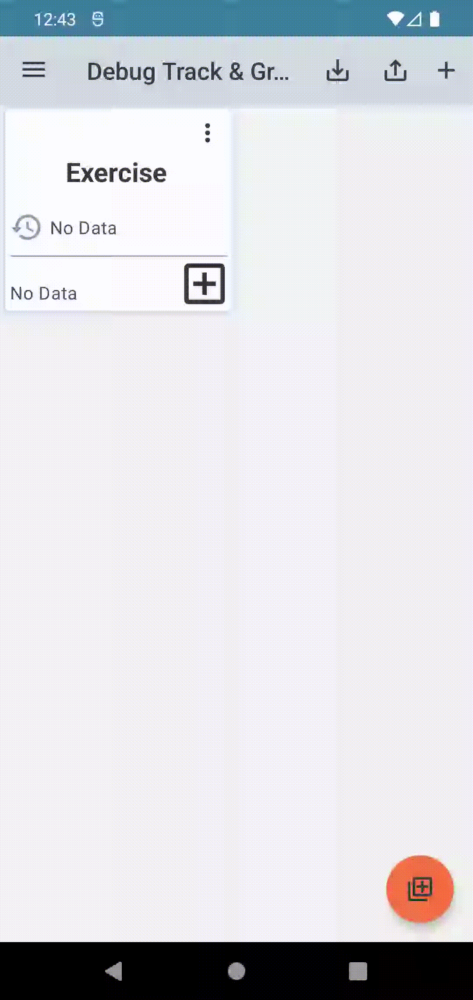
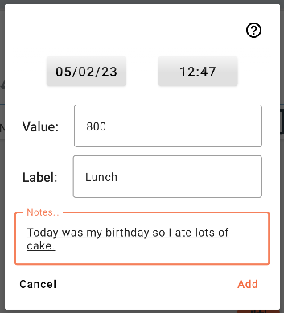
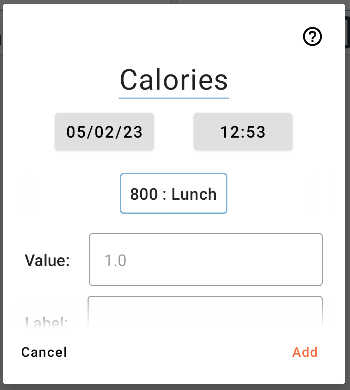
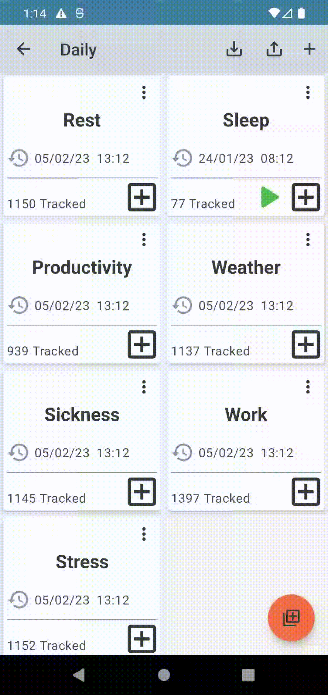

# How do I start tracking something?

To begin tracking you will need to create a Tracker.

---

As a minimum you will need to give your tracker a name. You can also optionally add a longer description. The description can later be seen via the context menu of the tracker.

---

A Tracker holds a list of data points ordered by time. Each data point has the following information:

- A timestamp
- A value 
- An optional label
- An optional note

The value is usually just a number, but it can also be a time or duration. If you check the box "This is a time or duration" you will be asked for values in hours, minutes and seconds and you will be able to start a timer using that tracker. Internally this information is still stored as a number (specifically the total number of seconds tracked).

Labels and notes are both text inputs. Labels are useful for categorising data. For example if you wanted to track calories for breakfast, lunch, and dinner, you could track the calories in the value field and the word "breakfast", "lunch" or "dinner" in the label field. Use the note field to add more contextual information like "Today was my birthday so I ate lots of cake."

---

Any previous values you have tracked will later appear as buttons on the tracker input dialog. If you press the button that value/label is tracked immediately. If you long press the button the tracker input is filled for you and you can edit it before adding that data point. This means you can create multiple choice style answers for your self.

---

Use groups to organise your trackers. You can move a tracker to a group using the trackers context menu:

---

When you have multiple trackers in a group you can use the quick track button to quickly track them all at once:

---

You can also reorder items in a group by holding down and dragging them: 

---

To view, edit and delete your data points tap on the center of a tracker:

---

You can edit all the data points for a tracker at once using the edit button in the top right. 

### WARNING: It is recommended that you back up your data before doing so as this will change all your data points at once and can not be undone.

The "Where" section allows you to specify which data points you want to update. Any data points that match any of the input data will be updated. For example if you check value and input 56, then any data point that has a value of 56 will be updated. If you check label and input "Small" then any data point with the label "Small" will be updated (this is case sensitive so "Small" will not match "small"). If you check both value and label, then only data points with both the given value and the given label will be updated. 

---

### Advanced tracker options

When creating a tracker you can set a "default value" for that tracker. If you do this you will not be asked for a value when you tap the + button. Instead the default value will immediately be tracked at the current time. You can still track a custom value by long pressing the + button on the tracker.

If you want to change the behaviour of the suggested values you can do so using the suggestions type and order settings. When you tap a suggested value the value and label fields are filled out and the data point is tracked immediately. You can long press a suggested value to fill out the fields without tracking so that you can edit one or more of the fields before tracking. 

By default previous tracked data points are used to create suggestions. Both the value and the label are used to create the suggestion and they are ordered ascending by value. If you change the suggestion type to labels only then tapping a suggestion will track a data point with that label and the default value of 1. If you change it to value only it will track a data point with that value and an empty label.

