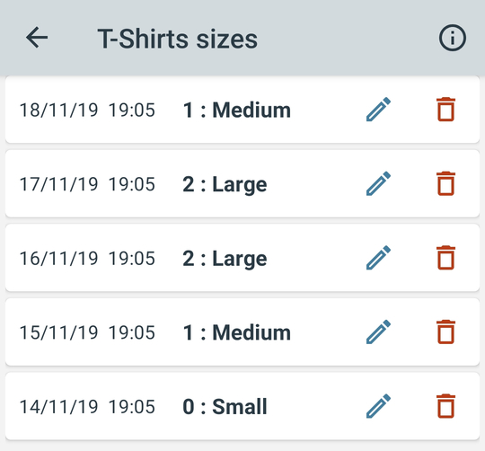

# How does multiple choice data work?

Using the multiple choice input type is recommended wherever possible. If you ever want to draw a pie chart from your data you will need it to be in multiple choice form. You can also draw a line graph of your data over time if your predefined answers have a natural order. For example say you were to setup the following:

And then you tracked some data as follows:

You could then visualise that data using either a line graph over time or using a pie chart as below:

