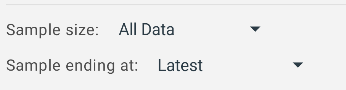
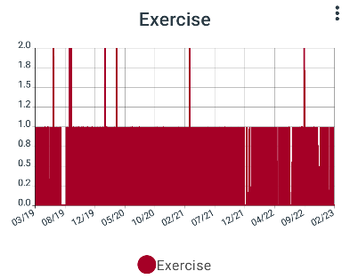
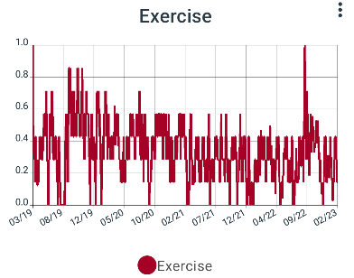

# Line graphs

To create a line graph use the + icon in a group and create a graph. Select line graph and give your graph a name.

---

To control the window of time that this graph will show on the X axis use the Sample size and sample ending at controls. By default line graphs always ends at the last data point and will update automatically as you track more data. If you want to fix your graph at a certain point in time you can change "Sample ending at" to a custom date. 
 

---

Next add one or more lines to your graph by tapping the + bar at the bottom:

The name at the top will be shown in the graph key, it defaults to the name of the feature. 

On the left you can select the colour of the line and the style of the line. 

In the middle there are 3 inputs: 

- At the top is the feature. If you tap this box you can select a feature, by it's path from the root group to the feature.
- Next is the averaging mode. If you select an averaging mode each point on the line will show as the moving average of its value and all values previous within the given time frame. 
- Finally is the plot total setting. This will be explained more below but essentially it will force the line to have a regular distribution of points on the X axis and will use the sum of all data points in the given period as the value on the Y axis. 

At the bottom is the Offset and Scale. The order of operations is as follows: 

1. First your data is converted to totals using the plot total setting
2. Then each point is converted to its moving average using the moving average setting
3. Then each point is multiplied by the scale value
4. Finally the offset is added to each point

---

## Plot totals and Moving averages

If for example you were to track when ever you exercise using a default value of 1 you would find when you came to draw a graph of that data that the line draws simply as a straight line at the point 1 on the Y axis: 

What you are most likely interested in is how many times you exercised each day, week, or month. To draw this line instead change the plot total setting from "Plot when tracked" to for example "Daily total". This setting will take the total of all values tracked per day and plot that on the graph with one point at the end of each day.

This graph is quite precise but still far too noisy to really make sense of. The line jumps between values of 1 and 0. However if you now change moving average setting to weekly you can see something more helpful: 

--- 

You can add multiple lines to the same graph to get a better overview of your data.

