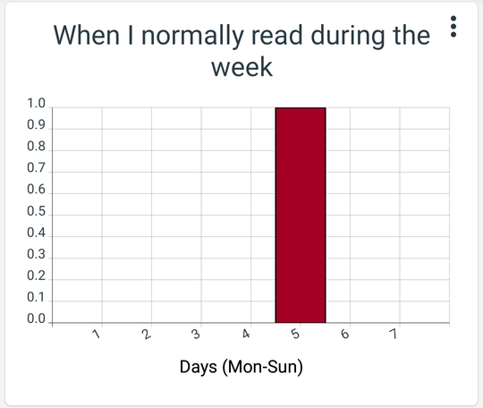
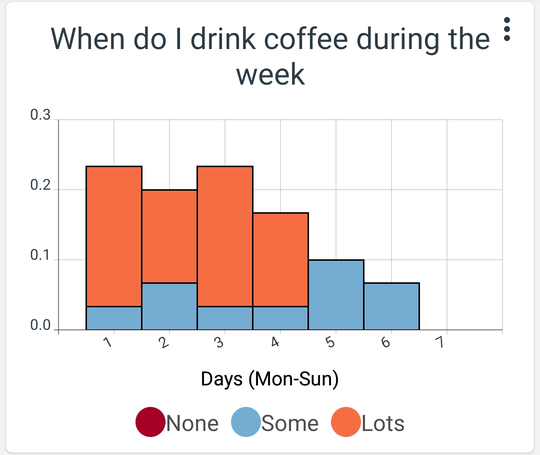

# How do time histograms work?

Histograms are useful for showing how data is distributed over a given domain. Time histograms in Track & Graph allow you to see how your data is distributed over various time periods.

For example imagine you had tracked 7 weeks worth of data on how much time you spent reading. You may wish to know on what days during the week do you typically spend the most time reading. Here you could use a time histogram with the following setup:

To generate the following histogram:

The histogram is calculated simply by taking every data point within the sample and adding its value to a \"bin\" based on which day of the week that value was tracked. So the day 1 bin represents the total of all data points tracked on Mondays divided by the total of all data points in the sample. Histograms are \"normalised\" meaning that the sum of all the heights of the bars (or the area under the graph) should add up to exactly 1. So for example if you only ever read on Fridays you would expect your histogram to only show one bar for Friday with height 1.

If you read on Saturday 50% of the time and on Friday 50% of the time you would expect your histogram to look like this:

If the data you are tracking has labels then Track & Graph will show you the distribution within each bar of the amount made up by each choice tracked like so:

By default the height of each bar is relative to the sum of all the data point values that fall in that time range. However if the weight of each of your data points should be the same regardless of its value then your histogram may be incorrectly skewed.

To fix this you can check the box marked: \"Check here to count the number of data points tracked rather than the total of their values.\"

This way each data point will be regarded as having the same weight in the histogram.

One final note to bare in mind is that your data may be skewed by the fact that you have not tracked data for each histogram bin yet or have not tracked them all equally yet. So for example if you are drawing a yearly histogram but have only been tracking for 6 months then your histogram may look like this:

And a year later it may look like this:

Over time however this skew will tend to 0. Therefore the more data you have tracked the more accurate the histogram will be.
