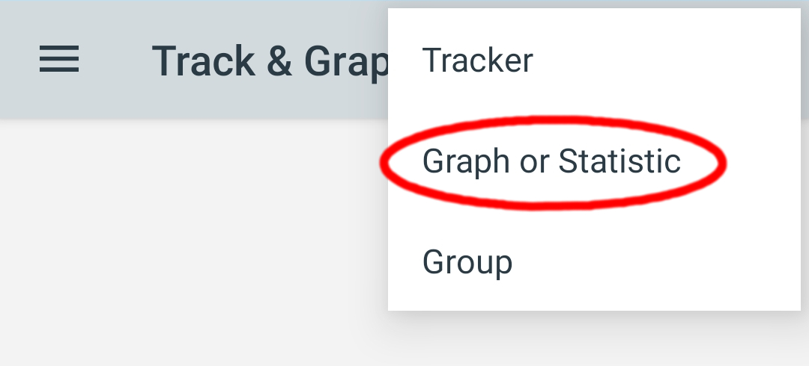
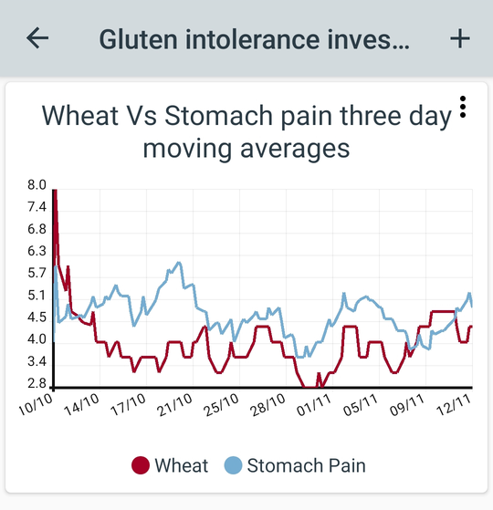
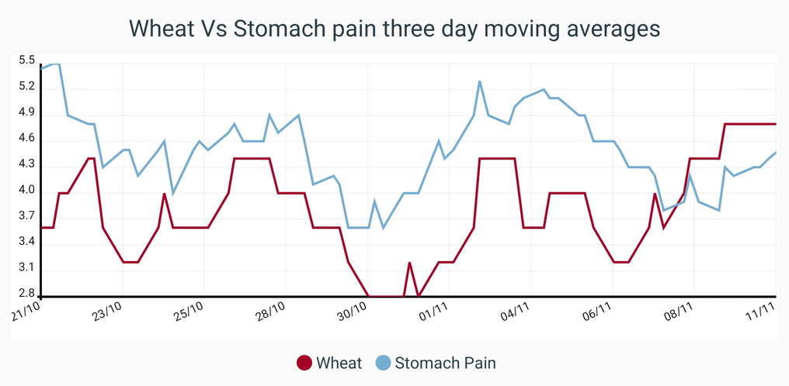

# How do I start creating graphs?

To begin creating graphs you will need to first have some data tracked. Then go to the group where you want to create your graph, tap + in the top right and then select Graph or Statistic.

Begin by entering a name for your new graph and then select a graph type. Here we will demonstrate the line graph since other graph types are relatively trivial to set up. One caveat to note however is that you can only create pie charts from multiple choice data.

The Dynamic range style will automatically calculate the min and max value for the Y axis. Now we will add some lines to our graph by using the + button at the bottom:

Because our wheat values are multiple choice answers ranging from 0–2 and our stomach pain values are numbers ranging from 1–8 we have multiplied our wheat values by 4 to make the ranges similar. We have used a three day moving average to smooth out anomalies and reduce noise in the output graph. We have also selected plot when tracked because this data was tracked relatively consistently. You can read more about how these settings affect line graphs in the FAQ: “How are moving averages and plot totals calculated?”

Next we click the FINISH button to complete the setup. Notice how our new graph appears as a card in our group:

To explore the graph in more detail you can tap the card to open it in a full screen view and then pinch and drag the lines:

As we add more graphs and statistics to our group they appear as a list of cards. You can reorder them at any point by holding down and dragging a card to a new position.

