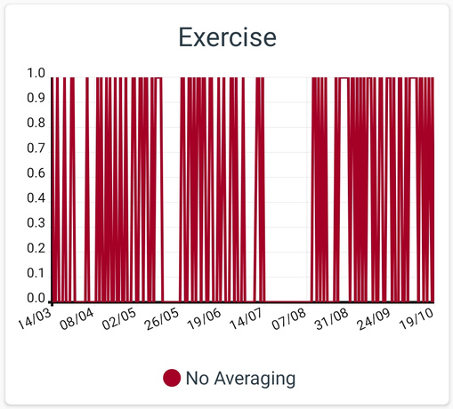
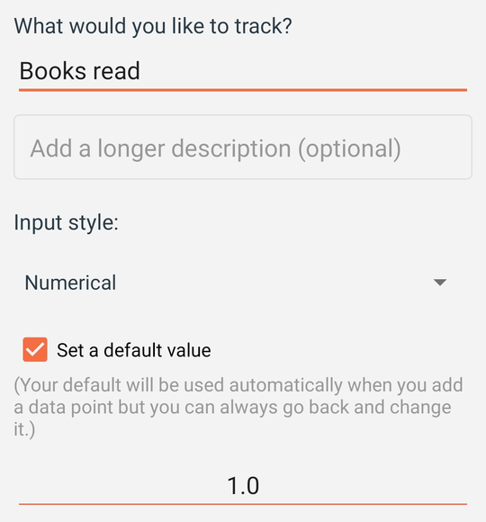
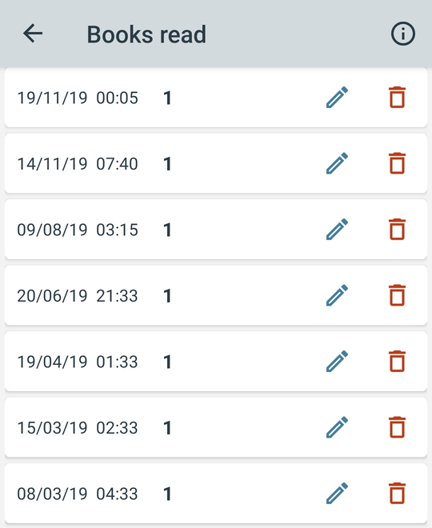

# How are moving averages and plot totals calculated?

Moving averages:

Suppose we want to track something simply as a yes or no question, for example:

If we were to track this data over time without using a moving average it might look like this:

This output is very accurate but not very helpful. To make it easier to understand the data we could use a monthly moving average:

Now instead of plotting each data point with the recorded Y value (0 or 1), each Y value is calculated as the mean of itself and all previous data points within the selected time range prior.

Generally speaking the longer the selected averaging period the smoother the curve will appear. However note that moving averages are lagging indicators. The longer the averaging period, the further behind the real value the curve will lag.

Plot totals:

Some things you may only want to track rarely. For example, you may want to track when you finish reading a book:

Suppose you tracked the following:

You may or may not then be surprised to find that your graph appears as follows:

The problem is that lines are drawn only from each plotted value to the next plotted value. Since all plotted values are interpreted as 1 you only see a straight line at the point 1 on the Y axis.

We can fix this using plot totals. For example if we plot monthly totals we would see the following graph:

Notice a point is plotted at the end of each month representing the total of all tracked values in that month.

You can use scale, offset, averaging and totals all at once. The order of precedence is as follows:

• First your data is converted to totals\n\n• Then each point is converted to its moving average\n\n• Then your points are multiplied by the scale value\n\n• Finally the offset is added to each point
