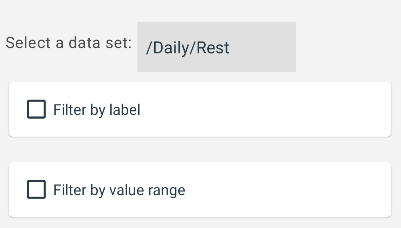
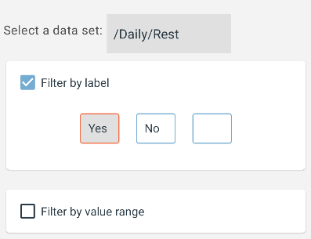
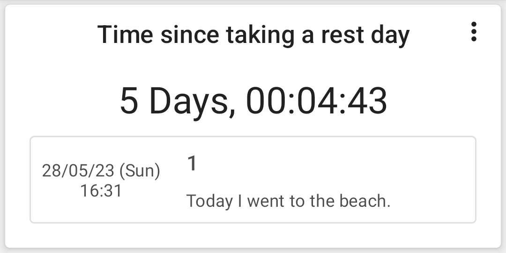

# Statistics

Currently there are only a couple of supported statistics: "Average time between" and "Last Tracked/Time since".

---

Both present you with the following interface: 

{ width="400" }

First select a data set and then optionally add filters for label and value range. For example if you want to know the average time between tracking "Yes" for /Daily/Rest you can add the label filter and select "Yes".
 
{ width="400" }

The statistics are calculated in the following ways:

- Average time between shows the duration between the first and last data point matching all filters in the feature divided by the number of data points matching all features minus 1 `(last-first)/(size - 1)`
- Last Tracked/Time since last shows the last data point matching all filters and also the time since that data point was tracked

---

{ width="400" }
