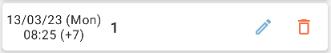

# Timestamps

Sometimes you may notice that a + or - number is appended to your timestamp as in the following:

This means that this data point was tracked in a different time zone to your current time zone. One common reason for this is that your clock went forward/back for daylight savings. Another reason this might happen is if you tracked the data point in a different country. 

Essentially what is shown is the time that the clock would have said on your device at the moment you tracked the data point, and then the number of hours you must add or subtract to put it in your current timezone. So if you track a data point in a zone which is 3 hours ahead and then you change your time zone back you will see a (-3) after your data point. 
