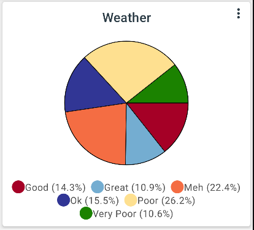

# Pie charts

Pie charts can be set up from the create graph or stat menu. The segments are simply one per label in the selected feature. 

The size of the segment is proportional to the number of data points with that label. 

By default the size of each segment is proportional to the sum of the values tracked for that label. You can change this behaviour by checking the box to count the number of data points rather than the total of their values.

{ width="400" }
