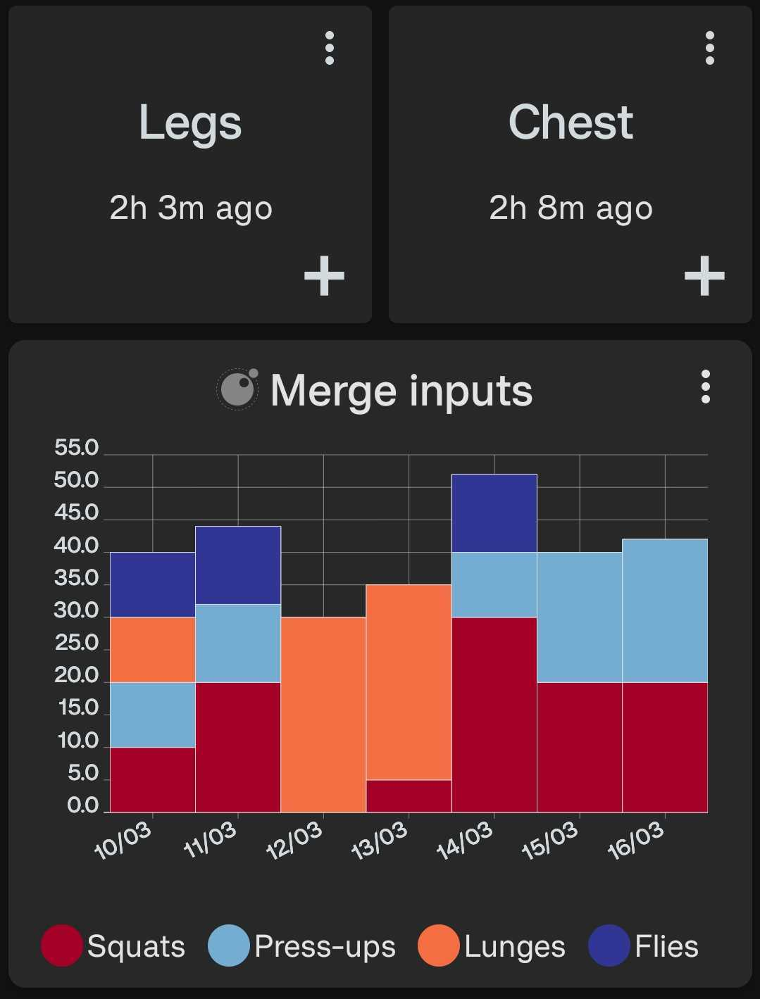

# Merge Inputs

Plots all provided data sources in a single bar chart where all data points are sorted by their timestamp.

<div style="text-align: center;">
    
</div>

## Configuration

This script accepts the following configuration parameters:

```lua
local core = require("tng.core")
local graph = require("tng.graph")
-- Optional period of data to be displayed e.g. core.PERIOD.WEEK to only show 1 week of data
local period = nil
-- Optional integer value used with period e.g. 5
local period_multiplier = nil
-- If from_now is false the end of the graph will be the last datapoint, otherwise it's the current date/time
local from_now = false
-- Totalling period used to calculate 'plot totals'
local totalling_period = core.PERIOD.DAY
-- Optional totalling period multiplier used to calculate 'plot totals' e.g. 2
local totalling_period_multiplier = nil
-- Optional boolean to count by label. If true, each datapoint counts as 1, and the value is ignored
local count_by_label = false
-- Optional colors list, e.g. { label: "#FF00FF", label2: "#0000FF", label3: core.COLOR.BLUE_SKY }
local label_colors = nil
-- Optional if the y axis represents time
local duration_based_range = false
-- Optional max for the y axis e.g. 100
local y_max = nil
```

[Install via deeplink](trackandgraph://lua_inject_url?url=https://www.github.com/SamAmco/track-and-graph/tree/master/lua/community/bar-charts/merge-inputs/script.lua)

[Read the full script](./script.lua)

Author: [SamAmco](https://github.com/SamAmco)
