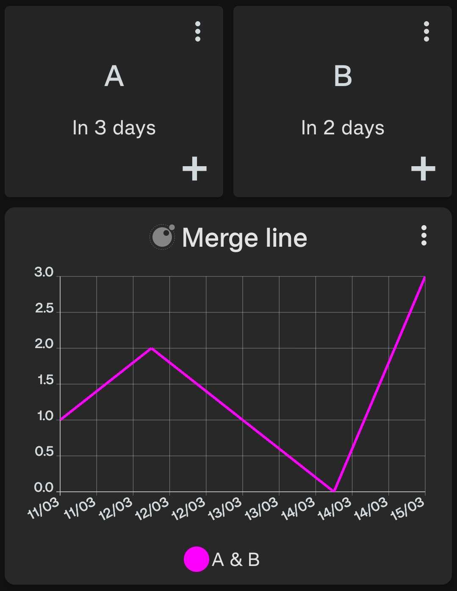

## Merge Inputs

Takes multiple inputs and merges them into a single output.

    

[Install via deeplink](trackandgraph://lua_inject_url?url=https://www.github.com/SamAmco/track-and-graph/tree/master/lua/community/line-graphs/merge-inputs/script.lua)

[Read the code](./script.lua)
